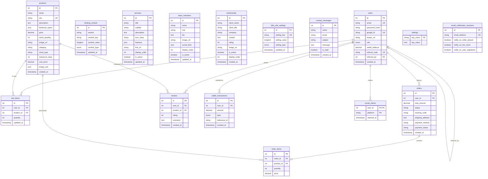

# 🗄️ Himalix Split Database Schema Blueprint

This document details the relational database design for the Himalix Labs platform. Rather than a unified database, it is divided into five distinct sub-module databases to maintain complete segregation of service data:
1. `himalix_portfolio`: General portfolio CMS components (landing content, services, testimonials, team members, contact messages).
2. `himalix_store`: E-commerce catalog, user registration (with virtual wallet balance), reviews, orders, and carts.
3. `himalix_3d`: 3D printing orders database (skeleton).
4. `himalix_web`: Web development agency projects database (skeleton).
5. `himalix_project`: Premade/custom projects orders database (skeleton).

---

## 🏗️ Relational Schema Diagram (Mermaid)



---

## 📊 Table Specifications

### 1. SHARED: `users`
Acts as the canonical registration and profile registry across all portfolio and storefront modules.
* **Fields:**
  * `id` `INT AUTO_INCREMENT PRIMARY KEY`
  * `email` `VARCHAR(255) NOT NULL UNIQUE`
  * `password_hash` `VARCHAR(255) DEFAULT NULL` — Nullable for pure Google OAuth accounts.
  * `google_id` `VARCHAR(255) DEFAULT NULL UNIQUE` — Stored from verified Google OAuth payloads.
  * `avatar_url` `VARCHAR(500) DEFAULT NULL` — Client profile picture linked from Google or uploaded assets.
  * `role` `ENUM('user', 'admin') NOT NULL DEFAULT 'user'` — Access level.
  * `wallet_balance` `DECIMAL(10,2) NOT NULL DEFAULT 0.00` — Store credit balance.
  * `referral_code` `VARCHAR(50) DEFAULT NULL UNIQUE` — Unique alphanumeric identifier (e.g. `HMX-REF-F72A9B`) assigned upon registration.
  * `referred_by` `INT DEFAULT NULL` — References `users(id)`. Binds the user to their inviter.
  * `created_at` `TIMESTAMP DEFAULT CURRENT_TIMESTAMP`
* **Constraints:**
  * `CONSTRAINT fk_users_referred_by FOREIGN KEY (referred_by) REFERENCES users(id) ON DELETE SET NULL`

---

### 2. LABS PORTFOLIO: `landing_content`
Stores key-value content strings grouped by webpage section to allow dynamic homepage CMS updates.
* **Fields:**
  * `id` `INT AUTO_INCREMENT PRIMARY KEY`
  * `section` `VARCHAR(50) NOT NULL` — Category key (e.g., `'hero'`, `'about'`, `'stats'`, `'contact'`, `'footer'`).
  * `content_key` `VARCHAR(100) NOT NULL` — Specific property (e.g. `'hero_headline'`).
  * `content_value` `LONGTEXT` — Value strings, paragraphs, or JSON dumps.
  * `content_type` `ENUM('text', 'html', 'json') DEFAULT 'text'`
  * `updated_at` `TIMESTAMP DEFAULT CURRENT_TIMESTAMP ON UPDATE CURRENT_TIMESTAMP`
* **Constraints:**
  * `UNIQUE KEY unique_section_key (section, content_key)`

---

### 3. LABS PORTFOLIO: `services`
Dynamic directory of company solutions rendered on the landing page services layout.
* **Fields:**
  * `id` `INT AUTO_INCREMENT PRIMARY KEY`
  * `title` `VARCHAR(255) NOT NULL` — Service name.
  * `subtitle` `VARCHAR(255) DEFAULT NULL`
  * `description` `TEXT DEFAULT NULL`
  * `icon_class` `VARCHAR(100) DEFAULT NULL` — FontAwesome class (e.g. `'fa-solid fa-microchip'`).
  * `features` `JSON DEFAULT NULL` — Array list of core highlights (e.g. `["Rapid Prototyping", "Material Variety"]`).
  * `link_url` `VARCHAR(500) DEFAULT '#'` — Router path or link.
  * `display_order` `INT DEFAULT 0` — Sort key for frontend layouts.
  * `is_active` `BOOLEAN DEFAULT TRUE` — Visibility toggle.
  * `updated_at` `TIMESTAMP DEFAULT CURRENT_TIMESTAMP ON UPDATE CURRENT_TIMESTAMP`

---

### 4. LABS PORTFOLIO: `team_members`
Executive founders list.
* **Fields:**
  * `id` `INT AUTO_INCREMENT PRIMARY KEY`
  * `name` `VARCHAR(255) NOT NULL`
  * `role` `VARCHAR(100) NOT NULL`
  * `bio` `TEXT DEFAULT NULL`
  * `image_url` `VARCHAR(500) DEFAULT NULL`
  * `social_links` `JSON DEFAULT NULL` — Key-value collection (e.g. `{"linkedin": "#", "github": "#"}`).
  * `display_order` `INT DEFAULT 0`
  * `is_active` `BOOLEAN DEFAULT TRUE`
  * `updated_at` `TIMESTAMP DEFAULT CURRENT_TIMESTAMP ON UPDATE CURRENT_TIMESTAMP`

---

### 5. LABS PORTFOLIO: `testimonials`
Customer review submissions carousel.
* **Fields:**
  * `id` `INT AUTO_INCREMENT PRIMARY KEY`
  * `client_name` `VARCHAR(255) NOT NULL`
  * `client_title` `VARCHAR(255) DEFAULT NULL` — Job role or designation.
  * `company` `VARCHAR(255) DEFAULT NULL` — School, office, or startup.
  * `content` `TEXT NOT NULL`
  * `rating` `INT DEFAULT 5` — Star score (1 to 5).
  * `image_url` `VARCHAR(500) DEFAULT NULL`
  * `is_active` `BOOLEAN DEFAULT TRUE`
  * `display_order` `INT DEFAULT 0`
  * `created_at` `TIMESTAMP DEFAULT CURRENT_TIMESTAMP`

---

### 6. LABS PORTFOLIO: `labs_site_settings`
Global website variables (logo image path, brand colors, contact coordinates, social platform links).
* **Fields:**
  * `id` `INT AUTO_INCREMENT PRIMARY KEY`
  * `setting_key` `VARCHAR(100) NOT NULL UNIQUE`
  * `setting_value` `LONGTEXT DEFAULT NULL`
  * `setting_type` `ENUM('text', 'image', 'json', 'boolean') DEFAULT 'text'`
  * `updated_at` `TIMESTAMP DEFAULT CURRENT_TIMESTAMP ON UPDATE CURRENT_TIMESTAMP`

---

### 7. LABS PORTFOLIO: `contact_messages`
Lead generation capture log from contact pages.
* **Fields:**
  * `id` `INT AUTO_INCREMENT PRIMARY KEY`
  * `name` `VARCHAR(255) NOT NULL`
  * `email` `VARCHAR(255) NOT NULL`
  * `subject` `VARCHAR(255) DEFAULT NULL`
  * `message` `TEXT NOT NULL`
  * `is_read` `BOOLEAN DEFAULT FALSE` — Admin read check.
  * `created_at` `TIMESTAMP DEFAULT CURRENT_TIMESTAMP`

---

### 8. E-COMMERCE STORE: `products`
The main catalog of robotics parts and project kits.
* **Fields:**
  * `id` `INT AUTO_INCREMENT PRIMARY KEY`
  * `name` `VARCHAR(255) NOT NULL`
  * `sku` `VARCHAR(100) NOT NULL UNIQUE` — Unique Stock Keeping Unit (e.g. `'HMX-ESP32-WROOM'`).
  * `description` `TEXT DEFAULT NULL`
  * `technical_specs` `JSON DEFAULT NULL` — Key-value map of technical specs (e.g. `{"Voltage": "3.3V", "Protocol": "WiFi/BLE"}`).
  * `price` `DECIMAL(10,2) NOT NULL` — Customer price.
  * `cost_price` `DECIMAL(10,2) NOT NULL DEFAULT 0.00` — Supplier acquisition cost.
  * `stock_quantity` `INT NOT NULL DEFAULT 0` — Items in inventory.
  * `image_url` `VARCHAR(500) DEFAULT NULL` — Main item thumbnail.
  * `image_urls` `JSON DEFAULT NULL` — Array collection of alternate item images.
  * `category` `VARCHAR(100) DEFAULT NULL` — Grouping tag (e.g. `'Processors'`, `'Sensors'`).
  * `stock_type` `VARCHAR(20) NOT NULL DEFAULT 'in_stock'` — Inventory style:
    * `'in_stock'` — Tracked stock level, inventory decreases on checkout.
    * `'outsourced'` — Made to order or external source. stock levels bypassed, outsource timeline checked.
  * `outsource_days` `INT NOT NULL DEFAULT 0` — Delay added to shipping ETA.
  * `created_at` `TIMESTAMP DEFAULT CURRENT_TIMESTAMP`

---

### 9. E-COMMERCE STORE: `cart_items`
Persistent user shopping carts.
* **Fields:**
  * `id` `INT AUTO_INCREMENT PRIMARY KEY`
  * `user_id` `INT NOT NULL`
  * `product_id` `INT NOT NULL`
  * `quantity` `INT NOT NULL DEFAULT 1`
  * `updated_at` `TIMESTAMP DEFAULT CURRENT_TIMESTAMP ON UPDATE CURRENT_TIMESTAMP`
* **Constraints:**
  * `UNIQUE KEY uq_cart_items_user_product (user_id, product_id)`
  * `CONSTRAINT fk_cart_items_user FOREIGN KEY (user_id) REFERENCES users(id) ON DELETE CASCADE`
  * `CONSTRAINT fk_cart_items_product FOREIGN KEY (product_id) REFERENCES products(id) ON DELETE CASCADE`

---

### 10. E-COMMERCE STORE: `orders`
Log of orders.
* **Fields:**
  * `id` `INT AUTO_INCREMENT PRIMARY KEY`
  * `user_id` `INT DEFAULT NULL` — Nullable if user account is deleted after order completion.
  * `total_amount` `DECIMAL(10,2) NOT NULL` — Total price (including shipping fee and sales tax).
  * `status` `VARCHAR(50) NOT NULL DEFAULT 'pending'` — Order step tracker: `'pending'`, `'processing'`, `'shipped'`, `'delivered'`, `'cancelled'`.
  * `tracking_code` `VARCHAR(100) NOT NULL` — Tracking ID (e.g. `HMX-171822-ABCD`).
  * `shipping_address` `TEXT DEFAULT NULL` — Stored JSON string of checkout inputs:
    * `{ fullName, email, phone, province, district, city, receivingLocation: "lat,lng", distanceKm, shippingFee, expectedDeliveryETA }`
  * `payment_method` `VARCHAR(50) NOT NULL DEFAULT 'cash'` — `'cash'` (COD) or `'store_credit'`.
  * `payment_status` `VARCHAR(50) NOT NULL DEFAULT 'unpaid'` — `'unpaid'` or `'paid'`.
  * `created_at` `TIMESTAMP DEFAULT CURRENT_TIMESTAMP`
* **Constraints:**
  * `CONSTRAINT fk_orders_user FOREIGN KEY (user_id) REFERENCES users(id) ON DELETE SET NULL`

---

### 11. E-COMMERCE STORE: `order_items`
Individual items within orders.
* **Fields:**
  * `id` `INT AUTO_INCREMENT PRIMARY KEY`
  * `order_id` `INT NOT NULL`
  * `product_id` `INT NOT NULL`
  * `quantity` `INT NOT NULL DEFAULT 1`
  * `price` `DECIMAL(10,2) NOT NULL` — Historical unit price of item at time of checkout.
* **Constraints:**
  * `CONSTRAINT fk_order_items_order FOREIGN KEY (order_id) REFERENCES orders(id) ON DELETE CASCADE`
  * `CONSTRAINT fk_order_items_product FOREIGN KEY (product_id) REFERENCES products(id) ON DELETE CASCADE`

---

### 12. E-COMMERCE STORE: `reviews`
Product ratings.
* **Fields:**
  * `id` `INT AUTO_INCREMENT PRIMARY KEY`
  * `user_id` `INT NOT NULL`
  * `product_id` `INT NOT NULL`
  * `rating` `INT NOT NULL` — Integer bounds (1 to 5).
  * `comment` `TEXT DEFAULT NULL`
  * `created_at` `TIMESTAMP DEFAULT CURRENT_TIMESTAMP`
* **Constraints:**
  * `CONSTRAINT fk_reviews_user FOREIGN KEY (user_id) REFERENCES users(id) ON DELETE CASCADE`
  * `CONSTRAINT fk_reviews_product FOREIGN KEY (product_id) REFERENCES products(id) ON DELETE CASCADE`

---

### 13. E-COMMERCE STORE: `wallet_transactions`
Auditable ledger recording all store credit balance changes.
* **Fields:**
  * `id` `INT AUTO_INCREMENT PRIMARY KEY`
  * `user_id` `INT NOT NULL`
  * `amount` `DECIMAL(10,2) NOT NULL` — Positive values for additions, negative values for purchases.
  * `type` `ENUM('deposit', 'purchase', 'refund', 'referral', 'social') NOT NULL` — Source description.
  * `reference_id` `VARCHAR(100) DEFAULT NULL` — Custom tracking string (e.g. `order_purchase_12`, `referral_bonus_for_inviting_24`).
  * `created_at` `TIMESTAMP DEFAULT CURRENT_TIMESTAMP`
* **Constraints:**
  * `CONSTRAINT fk_wallet_transactions_user FOREIGN KEY (user_id) REFERENCES users(id) ON DELETE CASCADE`

---

### 14. E-COMMERCE STORE: `social_claims`
Restricts user social media bonuses to one claim per platform.
* **Fields:**
  * `user_id` `INT NOT NULL`
  * `platform` `VARCHAR(50) NOT NULL` — Platform tag: `'instagram'`, `'facebook'`.
  * `claimed_at` `TIMESTAMP DEFAULT CURRENT_TIMESTAMP`
* **Constraints:**
  * `PRIMARY KEY (user_id, platform)`
  * `CONSTRAINT fk_social_claims_user FOREIGN KEY (user_id) REFERENCES users(id) ON DELETE CASCADE`

---

### 15. E-COMMERCE STORE: `settings`
System-wide store configuration options.
* **Fields:**
  * `key_name` `VARCHAR(255) NOT NULL PRIMARY KEY`
  * `key_value` `TEXT DEFAULT NULL`
* **Seeded Keys:**
  * `'low_stock_threshold'` (Default: `'5'`) — Alerts admin when inventory drops below this level.
  * `'sales_tax_rate'` (Default: `'13'`) — Value-added tax percentage.
  * `'maintenance_mode'` (Default: `'0'`) — Toggles shop offline.
  * `'store_banner_text'` — Promo notice.
  * `'google_client_id'` — OAuth ID.
  * `'google_client_secret'` — OAuth Secret.
  * `'google_auth_enabled'` (Default: `'1'`) — Toggles Google OAuth.
  * `'referral_bonus_amount'` (Default: `'5.00'`) — Credit earned for invitations.
  * `'social_bonus_amount'` (Default: `'5.00'`) — Credit earned for social follows.
  * `'whatsapp_express_number'` (Default: `'9779800000000'`) — Support chat number.
  * `'delivery_per_km_rate'` (Default: `'15.00'`) — Delivery rate per kilometer.
  * `'delivery_min_charge'` (Default: `'50.00'`) — Minimum shipping charge.
  * `'delivery_free_threshold'` (Default: `'2000.00'`) — Minimum subtotal for free delivery.

---

### 16. E-COMMERCE STORE: `email_notification_receivers`
Mailing list for automated operational updates.
* **Fields:**
  * `id` `INT AUTO_INCREMENT PRIMARY KEY`
  * `email_address` `VARCHAR(255) NOT NULL UNIQUE`
  * `notify_on_order_placed` `TINYINT(1) NOT NULL DEFAULT 1` — Receive email copy of all checkout receipts.
  * `notify_on_low_stock` `TINYINT(1) NOT NULL DEFAULT 1` — Receive alerts on low stock levels.
  * `notify_on_user_registered` `TINYINT(1) NOT NULL DEFAULT 1` — Receive signup notices.

---

## 🛠️ Schema Initialization SQL Scripts

Use the scripts below to initialize the split databases:

### 1. Authentication & Sessions Database: [auth.sql](file:///c:/xampp/htdocs/codes/himalix-labs/database/auth.sql)
```sql
DROP DATABASE IF EXISTS himalix_auth;
CREATE DATABASE himalix_auth
  CHARACTER SET utf8mb4
  COLLATE utf8mb4_unicode_ci;

USE himalix_auth;

-- User registry (Accounts and roles)
CREATE TABLE users (
    id              INT           NOT NULL AUTO_INCREMENT,
    email           VARCHAR(255)  NOT NULL,
    password_hash   VARCHAR(255)  DEFAULT NULL,
    google_id       VARCHAR(255)  DEFAULT NULL,
    avatar_url      VARCHAR(500)  DEFAULT NULL,
    role            ENUM('user','admin') NOT NULL DEFAULT 'user',
    wallet_balance  DECIMAL(10,2) NOT NULL DEFAULT 0.00,
    referral_code   VARCHAR(50)   DEFAULT NULL,
    referred_by     INT           DEFAULT NULL,
    created_at      TIMESTAMP     NOT NULL DEFAULT CURRENT_TIMESTAMP,
    PRIMARY KEY (id),
    UNIQUE KEY uq_users_email (email),
    UNIQUE KEY uq_users_google_id (google_id),
    UNIQUE KEY uq_users_referral_code (referral_code),
    CONSTRAINT fk_users_referred_by FOREIGN KEY (referred_by) REFERENCES users (id) ON DELETE SET NULL
) ENGINE=InnoDB DEFAULT CHARSET=utf8mb4 COLLATE=utf8mb4_unicode_ci;

-- User active login sessions
CREATE TABLE user_sessions (
    id              INT           NOT NULL AUTO_INCREMENT,
    user_id         INT           NOT NULL,
    session_token   VARCHAR(255)  NOT NULL,
    ip_address      VARCHAR(45)   DEFAULT NULL,
    user_agent      VARCHAR(500)  DEFAULT NULL,
    login_time      TIMESTAMP     NOT NULL DEFAULT CURRENT_TIMESTAMP,
    logout_time     TIMESTAMP     NULL DEFAULT NULL,
    is_active       TINYINT(1)    NOT NULL DEFAULT 1,
    created_at      TIMESTAMP     NOT NULL DEFAULT CURRENT_TIMESTAMP,
    PRIMARY KEY (id),
    UNIQUE KEY uq_session_token (session_token),
    CONSTRAINT fk_sessions_user FOREIGN KEY (user_id) REFERENCES users (id) ON DELETE CASCADE
) ENGINE=InnoDB DEFAULT CHARSET=utf8mb4 COLLATE=utf8mb4_unicode_ci;

-- Wallet transactions (auditable ledger, linked to active session)
CREATE TABLE wallet_transactions (
    id           INT            NOT NULL AUTO_INCREMENT,
    user_id      INT            NOT NULL,
    session_id   INT            DEFAULT NULL,
    amount       DECIMAL(10,2)  NOT NULL,
    type         ENUM('deposit', 'purchase', 'refund', 'referral', 'social') NOT NULL,
    reference_id VARCHAR(100)   DEFAULT NULL,
    created_at   TIMESTAMP      NOT NULL DEFAULT CURRENT_TIMESTAMP,
    PRIMARY KEY (id),
    CONSTRAINT fk_wallet_transactions_user    FOREIGN KEY (user_id)    REFERENCES users (id) ON DELETE CASCADE,
    CONSTRAINT fk_wallet_transactions_session FOREIGN KEY (session_id) REFERENCES user_sessions (id) ON DELETE SET NULL
) ENGINE=InnoDB DEFAULT CHARSET=utf8mb4 COLLATE=utf8mb4_unicode_ci;

-- Social follow credits claims
CREATE TABLE social_claims (
    user_id    INT         NOT NULL,
    platform   VARCHAR(50) NOT NULL,
    claimed_at TIMESTAMP   NOT NULL DEFAULT CURRENT_TIMESTAMP,
    PRIMARY KEY (user_id, platform),
    CONSTRAINT fk_social_claims_user FOREIGN KEY (user_id) REFERENCES users (id) ON DELETE CASCADE
) ENGINE=InnoDB DEFAULT CHARSET=utf8mb4 COLLATE=utf8mb4_unicode_ci;

-- Session-specific user activity logs
CREATE TABLE user_activity_logs (
    id              INT           NOT NULL AUTO_INCREMENT,
    user_id         INT           DEFAULT NULL,
    session_id      INT           DEFAULT NULL,
    action_type     VARCHAR(50)   NOT NULL,
    ip_address      VARCHAR(45)   DEFAULT NULL,
    details         TEXT          DEFAULT NULL,
    created_at      TIMESTAMP     NOT NULL DEFAULT CURRENT_TIMESTAMP,
    PRIMARY KEY (id),
    CONSTRAINT fk_logs_user    FOREIGN KEY (user_id)    REFERENCES users (id) ON DELETE SET NULL,
    CONSTRAINT fk_logs_session FOREIGN KEY (session_id) REFERENCES user_sessions (id) ON DELETE SET NULL
) ENGINE=InnoDB DEFAULT CHARSET=utf8mb4 COLLATE=utf8mb4_unicode_ci;

-- Seed default admin user
INSERT INTO users (email, password_hash, role, referral_code, wallet_balance) VALUES
('admin@himalix.com', '$2a$10$nF4N.20dM8/bLz60kQ8wUeD7b6/2R3/WJgGvK5KCePz5aG5DqK2yK', 'admin', 'HMX-REF-ADMIN1', 0.00);
```

### 2. General Portfolio CMS Database: [portfolio.sql](file:///c:/xampp/htdocs/codes/himalix-labs/database/portfolio.sql)
```sql
DROP DATABASE IF EXISTS himalix_portfolio;
CREATE DATABASE himalix_portfolio
  CHARACTER SET utf8mb4
  COLLATE utf8mb4_unicode_ci;

USE himalix_portfolio;

-- Landing page CMS content
CREATE TABLE landing_content (
    id            INT AUTO_INCREMENT PRIMARY KEY,
    section       VARCHAR(50)  NOT NULL,
    content_key   VARCHAR(100) NOT NULL,
    content_value LONGTEXT,
    content_type  ENUM('text', 'html', 'json') DEFAULT 'text',
    updated_at    TIMESTAMP DEFAULT CURRENT_TIMESTAMP ON UPDATE CURRENT_TIMESTAMP,
    UNIQUE KEY unique_section_key (section, content_key)
) ENGINE=InnoDB DEFAULT CHARSET=utf8mb4 COLLATE=utf8mb4_unicode_ci;

-- Services offered by Himalix Labs
CREATE TABLE services (
    id            INT AUTO_INCREMENT PRIMARY KEY,
    title         VARCHAR(255) NOT NULL,
    subtitle      VARCHAR(255),
    description   TEXT,
    icon_class    VARCHAR(100),
    features      JSON,
    link_url      VARCHAR(500),
    display_order INT DEFAULT 0,
    is_active     BOOLEAN DEFAULT TRUE,
    updated_at    TIMESTAMP DEFAULT CURRENT_TIMESTAMP ON UPDATE CURRENT_TIMESTAMP
) ENGINE=InnoDB DEFAULT CHARSET=utf8mb4 COLLATE=utf8mb4_unicode_ci;

-- Team members
CREATE TABLE team_members (
    id            INT AUTO_INCREMENT PRIMARY KEY,
    name          VARCHAR(255) NOT NULL,
    role          VARCHAR(100) NOT NULL,
    bio           TEXT,
    image_url     VARCHAR(500),
    social_links  JSON,
    display_order INT DEFAULT 0,
    is_active     BOOLEAN DEFAULT TRUE,
    updated_at    TIMESTAMP DEFAULT CURRENT_TIMESTAMP ON UPDATE CURRENT_TIMESTAMP
) ENGINE=InnoDB DEFAULT CHARSET=utf8mb4 COLLATE=utf8mb4_unicode_ci;

-- Client testimonials
CREATE TABLE testimonials (
    id            INT AUTO_INCREMENT PRIMARY KEY,
    client_name   VARCHAR(255) NOT NULL,
    client_title  VARCHAR(255),
    company       VARCHAR(255),
    content       TEXT NOT NULL,
    rating        INT DEFAULT 5,
    image_url     VARCHAR(500),
    is_active     BOOLEAN DEFAULT TRUE,
    display_order INT DEFAULT 0,
    created_at    TIMESTAMP DEFAULT CURRENT_TIMESTAMP
) ENGINE=InnoDB DEFAULT CHARSET=utf8mb4 COLLATE=utf8mb4_unicode_ci;

-- Labs-specific site settings
CREATE TABLE labs_site_settings (
    id             INT AUTO_INCREMENT PRIMARY KEY,
    setting_key    VARCHAR(100) UNIQUE NOT NULL,
    setting_value  LONGTEXT,
    setting_type   ENUM('text', 'image', 'json', 'boolean') DEFAULT 'text',
    updated_at     TIMESTAMP DEFAULT CURRENT_TIMESTAMP ON UPDATE CURRENT_TIMESTAMP
) ENGINE=InnoDB DEFAULT CHARSET=utf8mb4 COLLATE=utf8mb4_unicode_ci;

-- Contact form messages
CREATE TABLE contact_messages (
    id         INT AUTO_INCREMENT PRIMARY KEY,
    name       VARCHAR(255) NOT NULL,
    email      VARCHAR(255) NOT NULL,
    subject    VARCHAR(255),
    message    TEXT NOT NULL,
    is_read    BOOLEAN DEFAULT FALSE,
    created_at TIMESTAMP DEFAULT CURRENT_TIMESTAMP
) ENGINE=InnoDB DEFAULT CHARSET=utf8mb4 COLLATE=utf8mb4_unicode_ci;
```

### 3. Store E-Commerce Database: [store.sql](file:///c:/xampp/htdocs/codes/himalix-labs/database/store.sql)
```sql
DROP DATABASE IF EXISTS himalix_store;
CREATE DATABASE himalix_store
  CHARACTER SET utf8mb4
  COLLATE utf8mb4_unicode_ci;

USE himalix_store;

-- Products catalog
CREATE TABLE products (
    id               INT           NOT NULL AUTO_INCREMENT,
    name             VARCHAR(255)  NOT NULL,
    sku              VARCHAR(100)  NOT NULL,
    description      TEXT          DEFAULT NULL,
    technical_specs  JSON          DEFAULT NULL,
    price            DECIMAL(10,2) NOT NULL,
    stock_quantity   INT           NOT NULL DEFAULT 0,
    image_url        VARCHAR(500)  DEFAULT NULL,
    category         VARCHAR(100)  DEFAULT NULL,
    stock_type       VARCHAR(20)   NOT NULL DEFAULT 'in_stock',
    outsource_days   INT           NOT NULL DEFAULT 0,
    cost_price       DECIMAL(10,2) NOT NULL DEFAULT 0.00,
    image_urls       JSON          DEFAULT NULL,
    created_at       TIMESTAMP     NOT NULL DEFAULT CURRENT_TIMESTAMP,
    PRIMARY KEY (id),
    UNIQUE KEY uq_products_sku (sku)
) ENGINE=InnoDB DEFAULT CHARSET=utf8mb4 COLLATE=utf8mb4_unicode_ci;

-- Shopping cart items
CREATE TABLE cart_items (
    id         INT       NOT NULL AUTO_INCREMENT,
    user_id    INT       NOT NULL,
    product_id INT       NOT NULL,
    quantity   INT       NOT NULL DEFAULT 1,
    updated_at TIMESTAMP NOT NULL DEFAULT CURRENT_TIMESTAMP ON UPDATE CURRENT_TIMESTAMP,
    PRIMARY KEY (id),
    UNIQUE KEY uq_cart_items_user_product (user_id, product_id),
    CONSTRAINT fk_cart_items_user    FOREIGN KEY (user_id)    REFERENCES himalix_auth.users (id) ON DELETE CASCADE,
    CONSTRAINT fk_cart_items_product FOREIGN KEY (product_id) REFERENCES products (id) ON DELETE CASCADE
) ENGINE=InnoDB DEFAULT CHARSET=utf8mb4 COLLATE=utf8mb4_unicode_ci;

-- Orders
CREATE TABLE orders (
    id               INT           NOT NULL AUTO_INCREMENT,
    user_id          INT           DEFAULT NULL,
    session_id       INT           DEFAULT NULL,
    total_amount     DECIMAL(10,2) NOT NULL,
    status           VARCHAR(50)   NOT NULL DEFAULT 'pending',
    tracking_code    VARCHAR(100)  NOT NULL,
    shipping_address TEXT          DEFAULT NULL,
    payment_method   VARCHAR(50)   NOT NULL DEFAULT 'cash',
    payment_status   VARCHAR(50)   NOT NULL DEFAULT 'unpaid',
    created_at       TIMESTAMP     NOT NULL DEFAULT CURRENT_TIMESTAMP,
    PRIMARY KEY (id),
    CONSTRAINT fk_orders_user    FOREIGN KEY (user_id)    REFERENCES himalix_auth.users (id) ON DELETE SET NULL,
    CONSTRAINT fk_orders_session FOREIGN KEY (session_id) REFERENCES himalix_auth.user_sessions (id) ON DELETE SET NULL
) ENGINE=InnoDB DEFAULT CHARSET=utf8mb4 COLLATE=utf8mb4_unicode_ci;

-- Order line items
CREATE TABLE order_items (
    id         INT            NOT NULL AUTO_INCREMENT,
    order_id   INT            NOT NULL,
    product_id INT            NOT NULL,
    quantity   INT            NOT NULL DEFAULT 1,
    price      DECIMAL(10,2)  NOT NULL,
    PRIMARY KEY (id),
    CONSTRAINT fk_order_items_order   FOREIGN KEY (order_id)   REFERENCES orders (id) ON DELETE CASCADE,
    CONSTRAINT fk_order_items_product FOREIGN KEY (product_id) REFERENCES products (id) ON DELETE CASCADE
) ENGINE=InnoDB DEFAULT CHARSET=utf8mb4 COLLATE=utf8mb4_unicode_ci;

-- Product reviews
CREATE TABLE reviews (
    id         INT       NOT NULL AUTO_INCREMENT,
    user_id    INT       NOT NULL,
    product_id INT       NOT NULL,
    rating     INT       NOT NULL,
    comment    TEXT      DEFAULT NULL,
    created_at TIMESTAMP NOT NULL DEFAULT CURRENT_TIMESTAMP,
    PRIMARY KEY (id),
    CONSTRAINT fk_reviews_user    FOREIGN KEY (user_id)    REFERENCES himalix_auth.users (id) ON DELETE CASCADE,
    CONSTRAINT fk_reviews_product FOREIGN KEY (product_id) REFERENCES products (id) ON DELETE CASCADE
) ENGINE=InnoDB DEFAULT CHARSET=utf8mb4 COLLATE=utf8mb4_unicode_ci;

-- Store configuration settings
CREATE TABLE settings (
    key_name  VARCHAR(255) NOT NULL,
    key_value TEXT         DEFAULT NULL,
    PRIMARY KEY (key_name)
) ENGINE=InnoDB DEFAULT CHARSET=utf8mb4 COLLATE=utf8mb4_unicode_ci;

-- Email notification receivers
CREATE TABLE email_notification_receivers (
    id                        INT          NOT NULL AUTO_INCREMENT,
    email_address             VARCHAR(255) NOT NULL,
    notify_on_order_placed    TINYINT(1)   NOT NULL DEFAULT 1,
    notify_on_low_stock       TINYINT(1)   NOT NULL DEFAULT 1,
    notify_on_user_registered TINYINT(1)   NOT NULL DEFAULT 1,
    PRIMARY KEY (id),
    UNIQUE KEY uq_receivers_email (email_address)
) ENGINE=InnoDB DEFAULT CHARSET=utf8mb4 COLLATE=utf8mb4_unicode_ci;
```

### 4. 3D Printing Database: [3d.sql](file:///c:/xampp/htdocs/codes/himalix-labs/database/3d.sql)
```sql
DROP DATABASE IF EXISTS himalix_3d;
CREATE DATABASE himalix_3d
  CHARACTER SET utf8mb4
  COLLATE utf8mb4_unicode_ci;
```

### 5. Web Custom Agency Database: [web.sql](file:///c:/xampp/htdocs/codes/himalix-labs/database/web.sql)
```sql
DROP DATABASE IF EXISTS himalix_web;
CREATE DATABASE himalix_web
  CHARACTER SET utf8mb4
  COLLATE utf8mb4_unicode_ci;
```

### 6. Robotics Projects Database: [project.sql](file:///c:/xampp/htdocs/codes/himalix-labs/database/project.sql)
```sql
DROP DATABASE IF EXISTS himalix_project;
CREATE DATABASE himalix_project
  CHARACTER SET utf8mb4
  COLLATE utf8mb4_unicode_ci;
```


